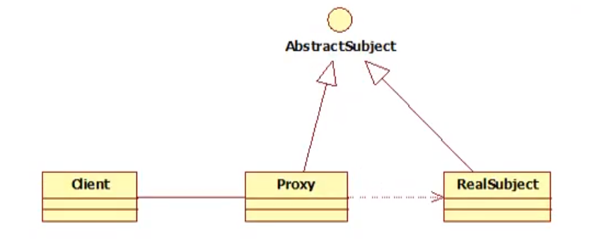

# 静态代理

## 静态代理的角色分析
* 抽象角色：一般使用接口或抽象类实现
* 真实角色：一般是抽象角色的实现类（被代理的角色）
* 代理角色：代理真实角色--代理真实角色后一般会做一些附属操作
* 客户端  ：使用代理角色来进行一些操作



## 代码实现
* Rent.java--抽象角色
```java
public interface Rent {
    public void rent();
}
```

* Host.java--真实角色
```java
public class Host implements Rent{
    @Override
    public void rent() {
        System.out.println("房屋出租");
    }
}
```
* Proxy.java--代理角色
```java
public class Proxy implements Rent{
    private Host host;
    public Proxy(Host host){
        this.host=host;
    }

    /**
     * 租房
     */
    @Override
    public void rent() {
        seeHouse();
        host.rent();
        fare();
    }
    /**
     * 看房
     */
    private void seeHouse(){
        System.out.println("带租客看房！");
    }
    /**
     * 收取中介费
     */
    private void fare(){
        System.out.println("收取中介费！");
    }
}
```
* Client.java--客户
```java
public class Client {
    public static void main(String[] args) {
        // 创建 真实角色
        Host host=new Host();
        // 创建 代理角色
        Proxy proxy=new Proxy(host);
        // 中介 代理售房
        proxy.rent();
    }
}
```

## 使用静态代理的好处
+ 使得真实角色处理的业务更加纯粹，不再关注一些公共的业务。
+ 公共业务由代理完成--实现业务的分工
+ 公共业务发生拓展时变得更加集中方便

## 缺点
> 增加了代理类，工作量变大，降低了开发效率

- 使用动态代理消除缺点